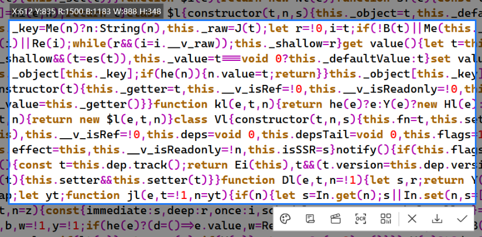

[简体中文](https://github.com/xland/ScreenCapture/) | English | [Русский](./ReadMe.ru-RU.md) | [Bahasa Indonesia](./ReadMe.id-ID.md)



**ScreenCapture** A powerful and lightweight Windows screenshot tool.

## Features

- Screenshot, drawing annotations, scrolling screenshot (long screenshot), screen recording (GIF/MP4), text recognition (OCR), QR code recognition.
- Color picker, supports shortcut keys to copy RGB color (`Ctrl+R`), HEX color (`Ctrl+H`) and CMYK color (`Ctrl+K`).
- Draw ellipses, perfect circles (hold `Shift`), rectangles, squares (hold `Shift`), arrows, numbered labels, etc.
- Draw curves, straight lines (hold `Shift`), mosaic, eraser, text.
- Modify or delete drawn elements at any time (hover the mouse over an element).
- Undo (`Ctrl+Z`), redo (`Ctrl+Y`), save to file (`Ctrl+S`), save to clipboard (`Ctrl+C` or double-click).
- Fast performance with low memory usage.
- Small size, a single executable file, no installation required, does not depend on any dynamic link libraries (except for text recognition).
- Supports a variety of command-line arguments for launching a specified function directly.
- Supports one-time execution mode (the process will not remain resident in the system).
- Multi-language support.

## Download

[Release](https://github.com/xland/ScreenCapture/releases/) (1MB)

## Supported Operating Systems

- Windows 10 1607 or Later

## Compilation

- The main branch depends on the [Ling](https://github.com/xland/Ling) GUI framework.
- The project can be compiled with Visual Studio 2026 (installed with the C++ Desktop Development Kit).
- [2.4.25 (based on D2D)](https://github.com/xland/ScreenCapture/tree/2.4.25) and [2.3.3 (based on Qt)](https://github.com/xland/ScreenCapture/tree/2.3.3_qt) are the previous stable branches.

## Command Line

```
// Terminate the process immediately after the capture is finished.
> ScreenCapture.exe --auto-quit=true

// Skip the toolbar once the region is selected and go straight into the specified feature:
// long = scrolling capture (long screenshot)
> ScreenCapture.exe --enter=long
// video = screen recording
> ScreenCapture.exe --enter=video
// ocr = text recognition
> ScreenCapture.exe --enter=ocr
// qr = QR code recognition
> ScreenCapture.exe --enter=qr

// The two arguments can be combined, for example: no tray icon, and the process quits right after the long screenshot is taken.
> ScreenCapture.exe --enter=long --auto-quit=true
```

## Text Recognition (OCR) Plugin

Download the latest version of the text recognition tool [ImageReader.exe](https://github.com/xland/ImageReader/releases) (about 25MB), place this file in the same directory as ScreenCapture.exe, or in the `%appdata%\ScreenCapture\plugin` directory, then restart the application to use it.

## Sponsor

<table>
  <tr>
    <td align="center">
      
      <p>Alipay Sponsor</p>
    </td>
    <td align="center">
      
      <p>WeChat Sponsor</p>
    </td>
    <td align="center">
      
      <p>Author WeChat</p>
    </td>
    <td align="center">
      
      <p>WeChat Blog: Desktop Software</p>
    </td>
  </tr>
</table>
