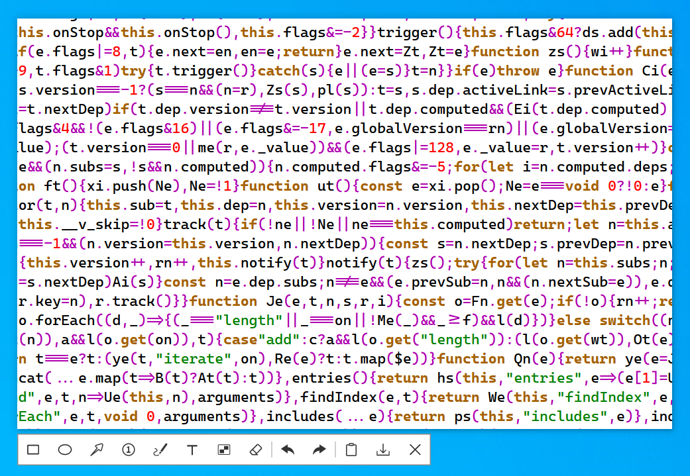

**Bahasa Indonesia** | [English](./ReadMe.md) | [简体中文](./ReadMe.zhcn.md) | [Русский](./ReadMe.ru.md)



# ScreenCapture

Alat penangkap layar Windows yang powerful dan ringan.

## Fitur

- Screenshot, anotasi, screenshot panjang (scroll), perekaman layar.
- Pipet warna dengan pintasan keyboard untuk menyalin warna RGB (`Ctrl+R`), HEX (`Ctrl+H`), dan CMYK (`Ctrl+K`).
- Menggambar elips dengan atau tanpa isi, lingkaran sempurna (tahan `Shift`), persegi panjang, persegi (tahan `Shift`), panah, label bernomor, dll.
- Menggambar kurva, garis lurus (tahan `Shift`), mosaik, penghapus, teks.
- Mengubah atau menghapus elemen yang telah digambar kapan saja (arahkan kursor mouse pada elemen).
- Urungkan (`Ctrl+Z`), ulangi (`Ctrl+Y`), simpan ke file (`Ctrl+S`), simpan ke clipboard (`Ctrl+C` atau klik dua kali).
- Screenshot panjang dengan scroll, perekaman layar (format output GIF/Mp4).
- Performa cepat dengan penggunaan memori minimal.
- Ukuran kecil, hanya satu file eksekusi, tanpa instalasi, tidak memerlukan pustaka tautan dinamis.
- Mendukung menjalankan fungsi tertentu secara langsung melalui argumen baris perintah.
- Mendukung mode sekali pakai (proses tidak akan terus berjalan di sistem).

## Unduh

[Release](https://github.com/xland/ScreenCapture/releases/) (778KB)

## Sistem Operasi yang Didukung

- Windows 10 1607 atau yang lebih baru

## Kompilasi

- Proyek ini tidak memiliki ketergantungan pustaka pihak ketiga selain pustaka bawaan sistem operasi.
- Proyek ini dapat dikompilasi dengan Visual Studio 2026 (dengan C++ Desktop Dev Kit terpasang).

## Baris Perintah

- Jangan menambahkan spasi di kedua sisi tanda sama dengan pada argumen baris perintah.
- Ketiga jenis argumen berikut dapat digunakan secara bersamaan. Contoh:
```
> ScreenCapture.exe enter=long tray=false auto-quit=true
```

```
// Jalankan dan langsung masuk ke mode screenshot (default).
> ScreenCapture.exe enter=cap

// Jalankan dan masuk ke mode screenshot panjang (scroll).
> ScreenCapture.exe enter=long

// Jalankan dan masuk ke mode perekaman layar.
> ScreenCapture.exe enter=video
```

```
// Tampilkan ikon di system tray (default).
> ScreenCapture.exe tray=true

// Sembunyikan ikon system tray.
> ScreenCapture.exe tray=false
```

```
// Biarkan proses tetap berjalan setelah screenshot selesai.
> auto-quit=false

// Hentikan proses segera setelah screenshot selesai.
> auto-quit=true
```

## Sponsor

<table>
  <tr>
    <td align="center">
      
      <p>Sponsor Alipay</p>
    </td>
    <td align="center">
      
      <p>Sponsor WeChat</p>
    </td>
    <td align="center">
      
      <p>WeChat Penulis</p>
    </td>
    <td align="center">
      
      <p>Blog WeChat: Desktop Software</p>
    </td>
  </tr>
</table>

Terima kasih kepada [EV Sign](https://evsign.cn/) atas layanan tanda tangan digital yang disediakan
