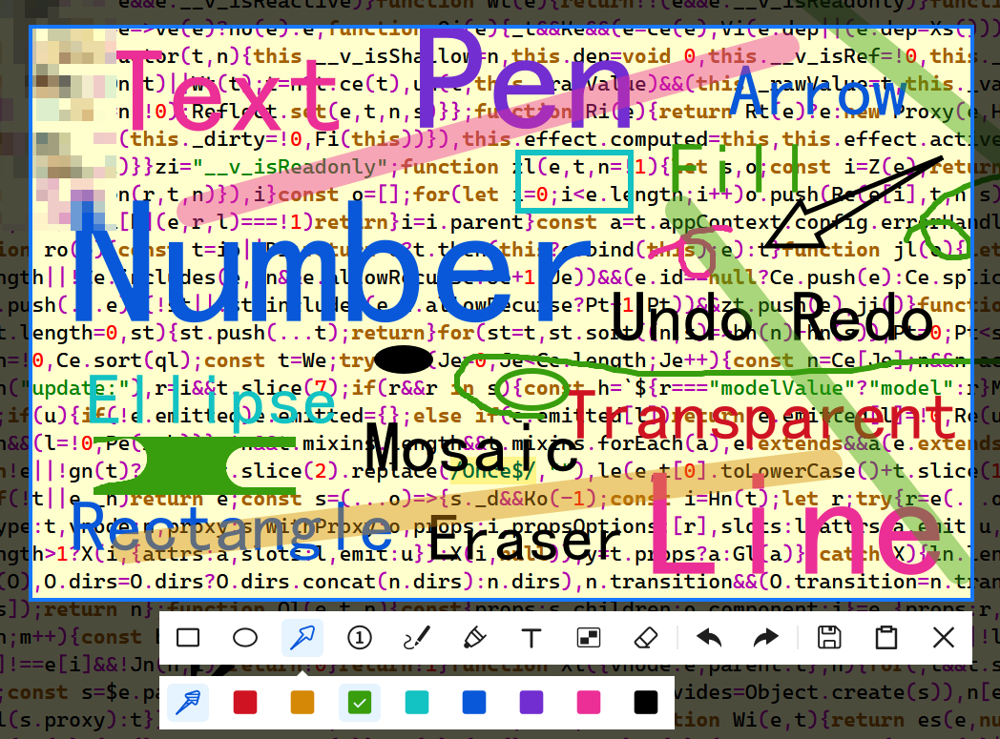

The next major version (2.0.0) is developed in the main branch.
The last stable version is available in the [1.x.y](https://github.com/xland/ScreenCapture/tree/1-x-y) branch.

---




# Features

- Multi-screen capture, Cross screen shot.
- Window area highlight.
- Draw circle,ellipse,square,rectangle,arrow,number(ordered) by diffrent colors (fill or not fill).
- Draw opacity line,free curve,mosaic,eraser.
- Undo Redo support (Shapes in history can be edited).
- Save to file or clipboard.
- Camera aperture,Copy pixel color(RGB,HEX).
- Very fast,Small memory footprint,Low CPU useage.
- Only one small executable file (with out any dll).
- Can be easily integrated into any program.

# Download

[Release](https://github.com/xland/ScreenCapture/releases/) (1.8M)

# Integration

(With Node.js Or Electron)

```js
let spawn = require("child_process").spawn;
let child = spawn("./path/to/ScreenCapture.exe")
child.on("close", (code) => {
    /// when code is:
    /// 0 undefined
    /// 1 quit by press close btn;
    /// 2 quit by press right mouse btn;
    /// 3 quit by press esc keyboard
    /// 4 quit when copy rgb color
    /// 5 quit when copy hex color
    /// 6 quit when save to file
    /// 7 quit when save to clipboard
    console.log("the quit code is:",code)
});
```

# Support OS

- Windows 10 1607 or Later

# HotKey

- Download [AutoHotKey](https://www.autohotkey.com/) and install it.
- Create a `.ahk` script file in `Startup` folder and set the file's content:
```c
/*
    C:\Users\[UserName]\AppData\Roaming\Microsoft\Windows\Start Menu\Programs\Startup\ScreenCapture.ahk
    ^  :  Ctrl
    !  :  Alt
    +  :  Shift
    #  :  Win
    The hotkey is Ctrl+Alt+A 
*/
^!A::Run "D:\path\to\ScreenCapture.exe"
```
- Double Click the `.ahk` file,then you can start the `ScreenCapture.exe` by press `Ctrl+Alt+A`.
- The `.ahk` script will be executed when the system startup.

# Licenses

This project is under the [MIT license](./licence).

